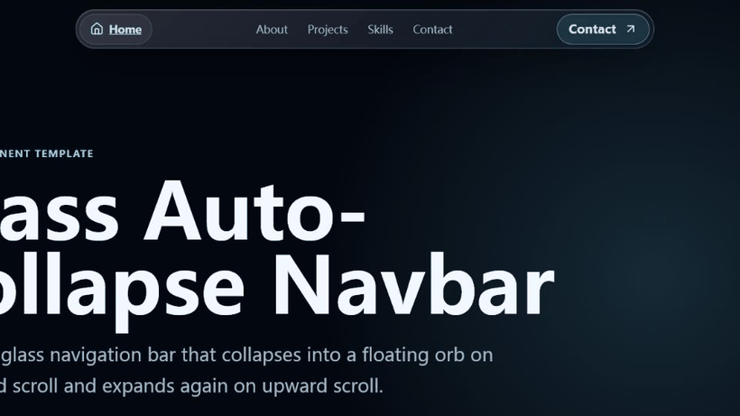

<p align="center">
  
</p>

# Silky Navbar / 丝滑的导航栏

A reusable React navigation bar with a frosted-glass look and scroll-aware behavior.

一个丝滑、可复用的 React 玻璃磨砂导航栏模板：向下滚动自动收缩成左上角圆形按钮，向上滚动自动展开，点击圆形按钮也可以展开。

## Features

- Frosted glass / glassmorphism navbar
- Collapses into a floating circular menu button on downward scroll
- Expands on upward scroll
- Keeps click-to-expand behavior for the compact orb
- Configurable navigation items and contact action
- Plain React + CSS, no animation library required
- Works well in Vite projects

## Demo

Run the demo locally:

```bash
npm install
npm run dev
```

Then open the printed local URL, usually:

```text
http://127.0.0.1:5173/
```

## Install In Your Project

Install the icon dependency:

```bash
npm install lucide-react
```

Copy these two files into your project:

```text
src/GlassNavbar.jsx
src/GlassNavbar.css
```

Then import and render the component near the top level of your app:

```jsx
import GlassNavbar from './GlassNavbar';

export default function App() {
  return (
    <>
      <GlassNavbar
        contactHref="mailto:hello@example.com"
        contactLabel="Contact"
        navItems={[
          { label: 'Home', href: '#top' },
          { label: 'About', href: '#about' },
          { label: 'Projects', href: '#projects' },
          { label: 'Skills', href: '#skills' },
          { label: 'Contact', href: '#contact' },
        ]}
      />
      <main>{/* Your page content */}</main>
    </>
  );
}
```

## Props

| Prop | Type | Default | Description |
| --- | --- | --- | --- |
| `navItems` | `{ label: string; href: string }[]` | Home/About/Projects/Skills/Contact | Navigation items. The first item is used as the brand/home button. |
| `contactHref` | `string` | `mailto:hello@example.com` | URL for the right-side contact button. |
| `contactLabel` | `string` | `Contact` | Text shown in the contact button. |

## Behavior

The navbar tracks scroll direction:

- Scroll down more than 2px: collapse into the orb
- Scroll up more than 2px: expand back into the full navbar
- Scroll to page top: expand and reset
- Click the orb: expand without changing scroll position

## Customize

Edit `GlassNavbar.css` to change:

- Width: `.glass-navbar { width: ... }`
- Compact orb position: `.glass-navbar-compact { top, left }`
- Accent color: `#74ddff` and `#b9efff`
- Glass intensity: `backdrop-filter`, background alpha, and border opacity
- Animation timing: `transition` values

## Notes

Put the navbar outside sections that create stacking contexts, such as elements using `isolation`, `transform`, or unusual `z-index`. A good pattern:

```jsx
<>
  <GlassNavbar />
  <main>
    <section id="top">...</section>
  </main>
</>
```

## License

MIT
